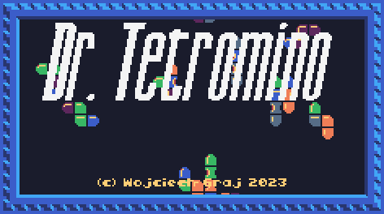
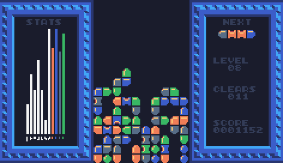

## Dr. Tetromino


An odd mix of Dr. Mario and a tetromino-dropping game which cannot be named for trademark reasons.

It can be played online [here](TODO), and executable downloads can be found [here](TODO).

Controls: Arrow Keys, Z, X



### License
```
    Copyright (C) 2023  Wojciech Graj

    This program is free software: you can redistribute it and/or modify
    it under the terms of the GNU Affero General Public License as published by
    the Free Software Foundation, either version 3 of the License, or
    (at your option) any later version.

    This program is distributed in the hope that it will be useful,
    but WITHOUT ANY WARRANTY; without even the implied warranty of
    MERCHANTABILITY or FITNESS FOR A PARTICULAR PURPOSE.  See the
    GNU Affero General Public License for more details.

    You should have received a copy of the GNU Affero General Public License
    along with this program.  If not, see <https://www.gnu.org/licenses/>.
```
